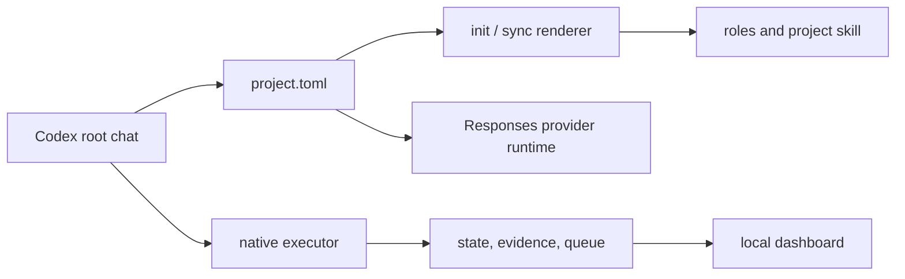

# Архитектура

OrchestraKit состоит из переносимого Python-набора, шаблонов и локальной панели.
Он не привязан к языку подключённого проекта. `.orchestra/project.toml` хранит
настройки конкретного проекта; сгенерированные файлы получают их через `sync`.

## Границы ответственности

| Часть | Ответственность | Не делает |
|---|---|---|
| Root Codex | Делит задачу, назначает роли, оценивает evidence, объединяет результат. | Не меняет свою модель из `project.toml`. |
| Конфигурация и рендеринг | Проверяет TOML и создаёт роли, навык проекта, инструкции и manifest. | Не перезаписывает неуправляемые пользовательские файлы. |
| Маршрутизация | Соотносит сложность, риск и возможности с профилем. | Не запускает модель и не заменяет решение руководителя. |
| Native executor | Запускает один ограниченный лист, сохраняет receipt и проверяет заданные команды. | Не принимает интеграцию и не разрешает листу делегировать работу. |
| State, evidence и queue | Сохраняют задачи, ревизии, snapshots, события, зависимости и lease. | Не выдают неполные данные за успешную проверку. |
| Dashboard | Читает локальные проекты, чаты и артефакты для показа в браузере. | Не запускает модели и не меняет данные наблюдения. |
| Provider runtime | Собирает настройки Responses-провайдера и передаёт секрет дочернему процессу. | Не хранит ключ в конфигурации и не обещает совместимость произвольного API. |

## Данные проекта

`init` создаёт `.orchestra/project.toml` и управляемые поверхности: роли в
`.codex/agents`, проектный навык в `.agents/skills/orchestrate-project`, блок
инструкций в `AGENTS.md` и `.orchestra/manifest.json`. Изменение конфигурации
требует `sync`; `doctor` проверяет, что управляемые файлы и локальные условия
согласованы.

Runtime сохраняет задачи, evidence, очередь, receipts и журналы в `.orchestra`.
Эти записи могут содержать пути, команды и текст локальных результатов, поэтому
они исключаются из обычного коммита. Конфигурацию и сгенерированные инструкции,
нужные для воспроизведения проекта, можно хранить в Git по правилам проекта.

## Исполнение и проверка

Постановка листовой задачи содержит шесть частей: цель, источники истины,
границы, критерии, проверку и контекст. Маршрутизация выбирает профиль по
сложности и риску. Независимая существенная работа может получить отдельного
исполнителя; небольшая связанная работа остаётся в root chat.

Исполнитель записывает попытку, завершённый ответ и результаты назначенных
проверок. Evidence привязано к отпечаткам исходников и журналов. При изменении
этих файлов доказательство устаревает. Очередь хранит граф зависимостей в
локальной SQLite-базе, ограничивает одновременные выдачи и использует fenced
lease для завершения узла. После истечения lease требуется явное восстановление,
чтобы работа не была повторена молча.

`require_fresh_evidence` выключен в стандартном шаблоне. Если проект включает
его, требования к source snapshot и evidence_ref становятся обязательными для
соответствующих проверок и выдач очереди. Политика review зависит от режима
`adaptive`, `strict` или `program`.

## Интеграция моделей

Профиль задаёт ID модели и reasoning effort. Codex root chat продолжает работать
с моделью, выбранной в интерфейсе Codex. Для внешнего профиля указывается
провайдер с `wire_api = "responses"`; требуемые возможности фильтруют
несовместимые профили ещё до запуска. Переменная окружения имеет приоритет над
macOS Keychain. Ни один из этих механизмов не выполняет проверочный платный
запрос и не подтверждает доступность модели для конкретного аккаунта.

## Связность и пределы

`check_execution.py` задаёт общую публичную валидацию и запуск ограниченных
проверок для `execution.py` и `evidence.py`. Изменения в этом контракте требуют
проверки обоих путей. Панель объединяет чтение локального состояния, адаптацию
данных Codex и HTTP-представление; её изменения требуют Python и
frontend-проверок.
Нативный запуск поддерживается на POSIX-хостах. Worktree ограничивает область
записи для исполнителя, но не является самостоятельной песочницей безопасности.
