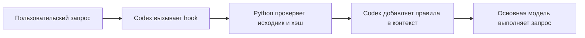

# Как работают hooks и Orchestra

Хук — обработчик, который программа вызывает при определённом событии. Вы задаёте код обработчика, а программа решает, когда его вызвать. В зависимости от события обработчик получает данные, выполняет действие и иногда может запретить продолжение.

Например, перед сохранением документа можно проверять его формат, а после сохранения отправлять уведомление. Этот принцип используется в разных программах; у каждой свои события и формат обработчиков.

| Где | Пример события | Что может сделать обработчик |
|---|---|---|
| Codex | Отправка пользовательского запроса | Добавить инструкции перед обращением к модели |
| Git | Попытка создать коммит, `pre-commit` | Запустить проверку и отклонить коммит при ошибке |
| GitHub webhook | Открытие pull request или push | Отправить HTTP-запрос на ваш сервер, который запустит обработку |

Git hook работает там, где выполняется Git; по умолчанию его скрипт лежит в `.git/hooks`. GitHub webhook отправляется из GitHub на настроенный адрес. GitHub Actions тоже может реагировать на события и запускать workflow в инфраструктуре CI; это отдельный способ автоматизации. [Git hooks](https://git-scm.com/docs/githooks), [GitHub webhooks](https://docs.github.com/en/webhooks/about-webhooks), [GitHub Actions events](https://docs.github.com/en/actions/reference/workflows-and-actions/events-that-trigger-workflows).

## Два обработчика Orchestra

`UserPromptSubmit` запускает наш Python-handler перед отправкой пользовательского запроса. Handler получает JSON события через stdin, читает установленный `SKILL.md`, проверяет ожидаемый SHA-256 и возвращает JSON с `additionalContext`. Codex добавляет этот текст в инструкции для модели. `SessionStart` с `source=compact` восстанавливает тот же текст после сжатия контекста. Исходник ограничен по размеру; несоответствие хэша останавливает поддерживаемую подачу запроса или продолжение. [Контракт hooks Codex](https://learn.chatgpt.com/docs/hooks).

После установки откройте `/hooks` и проверьте, что оба определения включены и
имеют доверенный статус. Статус доверия подтверждает разрешённую конфигурацию;
он не является журналом всех прошлых запусков.

Хук не делает работу языковой модели и не выбирает вместо неё ответ. Наш handler вообще не обращается к модели: это локальная программа. Он обеспечивает подачу инструкций. Основная модель отвечает за решение задачи и соблюдение этих инструкций.

## Где начинается оркестрация

Правила Orchestra задают порядок работы: определить требования и стек, выбрать нужные domain skills, написать проверку изменённого поведения, реализовать его, запустить проверки и оценить результат. Небольшую связанную задачу выполняет основная модель чата. Её модель остаётся той, которую вы выбрали в Codex.

При полезном делегировании профиль, reasoning effort, роли и ограничения берутся из `.orchestra/project.toml`. Native runner запускает ограниченного исполнителя через `codex exec`, сохраняет его события и выполняет заданные основным агентом проверки. Исполнитель не делегирует дальше. При обычной ошибке реализации допускается ремонт, затем эскалация в пределах разрешённого числа попыток. Недоступный инструмент или feature возвращает решение основному агенту; смена модели не выдаётся за исправление среды.

В 0.7 runner хранит этапы в атомарном `run.json`: перед запуском, после завершения исполнителя, после проверок и при завершении всего запуска. `receipt.json` фиксирует итог. Если основной процесс оборвётся, этап и пути к логам останутся для разбора. Автоматического повторения потенциальных побочных эффектов нет.

Опциональный `workflow.max_observed_tokens` ограничивает новые автоматические попытки по наблюдаемому входу плюс выходу всех предыдущих попыток. Кэшированный вход включён. Если счётчики отсутствуют или неполны, retry с включённым лимитом останавливается. Это не оценка денег и не строгий лимит первого API-запроса.

## Границы

OrchestraKit остаётся слоем правил и локального исполнения для Codex. Он не
запускает графовый сервер, не управляет cache или Batch API и не делает вывод о
стоимости или качестве по одному набору локальных наблюдений.
